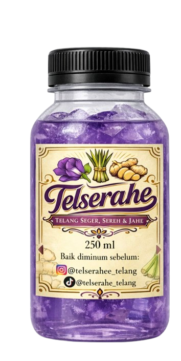
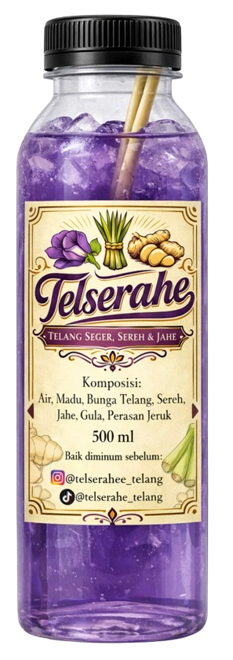

<head>

<meta charset="UTF-8">
<meta name="viewport" content="width=device-width, initial-scale=1.0">

<title>Telserahe</title>

<link href="https://fonts.googleapis.com/css2?family=Poppins:wght@300;400;600;700&display=swap" rel="stylesheet">

</head>

<body>

<header>

<nav>
<a href="#home">Home</a>
<a href="#manfaat">Manfaat</a>
<a href="#produk">Produk</a>
<a href="#testimoni">Testimoni</a>
<a href="#kontak">Kontak</a>
</nav>

</header>

<!-- HERO -->

<section class="hero" id="home">

<h1>Telserahe: Telang Segar, Serai & Jahe</h1>

Minuman herbal alami dengan perpaduan bunga telang, serai, jahe dan madu.
Segar, sehat, dan cocok diminum kapan saja.

<a class="btn" href="#produk">Pesan Sekarang</a>

</section>

<!-- MANFAAT -->

<section class="section" id="manfaat">

<h2>Manfaat Bahan Alami</h2>

<h3>🌸 Bunga Telang</h3>

Kaya antioksidan dan baik untuk kesehatan tubuh.

<h3>🌿 Serai</h3>

Menyegarkan tubuh dan membantu detoks alami.

<h3>🫚 Jahe</h3>

Menghangatkan tubuh dan meningkatkan imun.

<h3>🍯 Madu</h3>

Pemanis alami yang sehat dan menambah energi.

</section>

<!-- PRODUK -->

<section class="section" id="produk">

<h2>Produk Kami</h2>

<h3>Telserahe 250ml</h3>

Ukuran praktis untuk aktivitas sehari-hari.

Rp 6.000

<a class="btn" target="_blank"
href="https://wa.me/6282182167104?text=Halo%20Admin%20Telserahe,%0ASaya%20ingin%20memesan%20Telserahe%20250ml.%0AJumlah%20:%20...%20botol%0ANama%20:%20%0AAlamat%20:%20">
Pesan via WhatsApp
</a>

<h3>Telserahe 500ml</h3>

Ukuran lebih besar untuk dinikmati bersama.

Rp 10.000

<a class="btn" target="_blank"
href="https://wa.me/6282182167104?text=Halo%20Admin%20Telserahe,%0ASaya%20ingin%20memesan%20Telserahe%20500ml.%0AJumlah%20:%20...%20botol%0ANama%20:%20%0AAlamat%20:%20">
Pesan via WhatsApp
</a>

</section>

<!-- TESTIMONI -->

<section class="section" id="testimoni">

<h2>Testimoni Pelanggan</h2>

⭐️⭐️⭐️⭐️⭐️

"Minumannya segar banget, rasa jahenya pas dan aromanya wangi!"

⭐️⭐️⭐️⭐️⭐️

"Unik! Warna telangnya cantik dan rasanya menyehatkan."

</section>

<!-- CTA -->

<section class="cta">

<h2>Segarkan Harimu dengan Telserahe</h2>

Minuman herbal alami yang sehat dan menyegarkan.

 

<a class="btn"
href="https://wa.me/6282182167104?text=Halo%20Admin%20Telserahe,%20saya%20ingin%20memesan%20produk.">
Pesan Sekarang
</a>

</section>

<!-- KONTAK -->

<section class="section" id="kontak">

<h2>Kontak Kami</h2>

WhatsApp : 082182167104

Instagram : @telserahee_telang

Tiktok : @telserahe_telang

</section>

<footer>

© 2026 Telserahe - Telang Segar, Serai & Jahe

</footer>

<a href="https://wa.me/6282182167104?text=Halo%20Admin%20Telserahe,%20saya%20ingin%20bertanya%20tentang%20produk." 
class="wa-float">💬</a>

</body>
