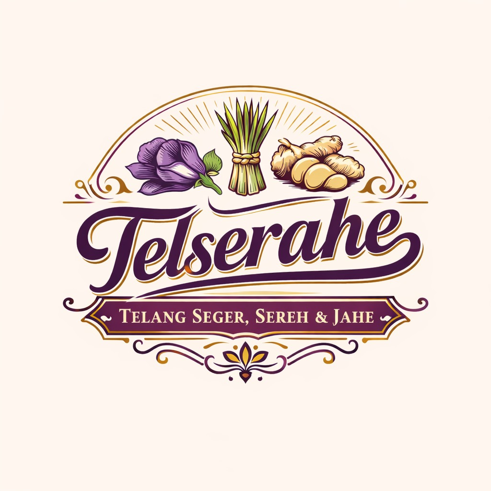
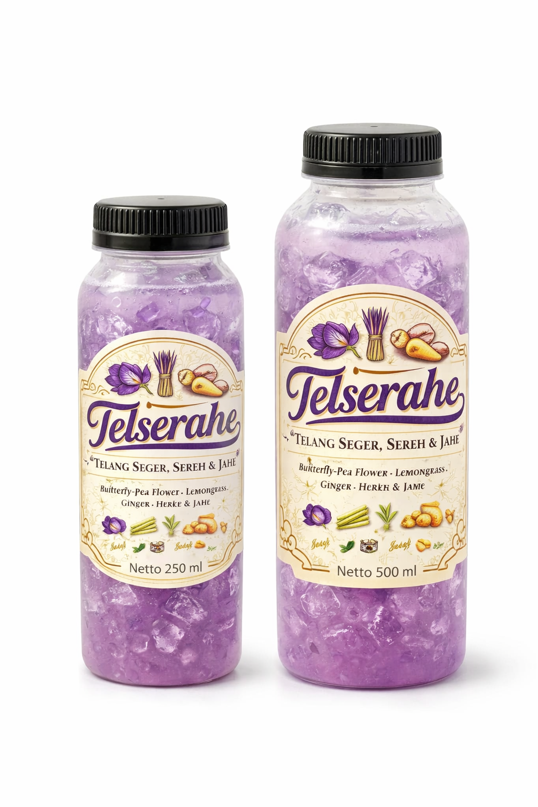

<head>

<meta charset="UTF-8">
<meta name="viewport" content="width=device-width, initial-scale=1.0">
<title>Telserahe</title>

<link href="https://fonts.googleapis.com/css2?family=Poppins:wght@300;400;600;700&display=swap" rel="stylesheet">

</head>

<body>

<header>

<nav>
<a href="#home">Home</a>
<a href="#manfaat">Manfaat</a>
<a href="#produk">Produk</a>
<a href="#kontak">Kontak</a>
</nav>

</header>

<section class="hero" id="home">

<h1>TELSERAHE</h1>

<h2>Telang Segar, Serai & Jahe</h2>

Minuman herbal alami dengan perpaduan bunga telang, serai, jahe dan madu.
Segar, sehat, dan cocok diminum kapan saja.

<a class="btn" href="#produk">Pesan Sekarang</a>

</section>

<footer>

© 2026 Telserahe - Telang Segar, Serai & Jahe

</footer>

<a href="https://wa.me/6282182167104" class="wa-float">💬</a>

</body>
